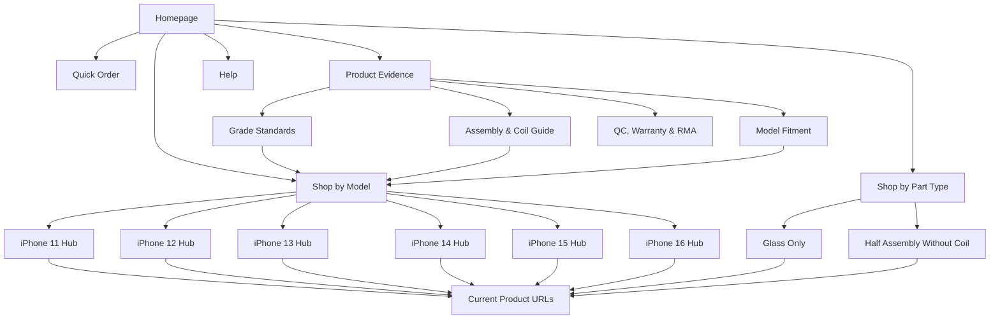

# US Search Architecture

**Status:** `SEO/GEO RESEARCH ONLY` — all 24 queries are `HYPOTHESIS`; demand,
rank, landing-page performance, and Google-selected canonicals are not measured.
**Last updated:** 2026-08-07

This document maps search intent to one canonical page family. It does not
authorize new Shopify pages, navigation changes, redirects, or publication.
Existing product URLs must be preserved unless an approved redirect plan says
otherwise.

## Portfolio Rules

The working portfolio contains 24 query hypotheses. A query becomes an approved
target only when all of these are recorded:

1. US demand from Search Console, Keyword Planner, Semrush, or another named
   source.
2. Current US mobile and desktop position from a reproducible rank source.
3. Commercial relevance to a currently approved product configuration.
4. One canonical landing page that satisfies the intent without cannibalizing
   another page.
5. A measurable path to qualified account creation, purchase, repeat purchase,
   or gross profit.
6. Sufficient unique product, fitment, grade, QC, or operational evidence to
   make the page useful.

Search volume, difficulty, CPC, and current Google rank are currently unknown.
The table must not be presented as keyword research data until those fields are
filled from an approved source.

## Query Hypotheses

| ID | Query | Intent | Canonical page family | Current state |
| ---: | --- | --- | --- | --- |
| 1 | wholesale iPhone back glass | Category purchase | Homepage or Glass Only hub | HYPOTHESIS |
| 2 | iPhone back glass wholesale | Category purchase | Glass Only hub | HYPOTHESIS |
| 3 | iPhone back glass supplier | Supplier selection | Homepage | HYPOTHESIS |
| 4 | iPhone rear glass wholesale | Category purchase | Glass Only hub | HYPOTHESIS |
| 5 | iPhone back glass supplier USA | US supplier selection | Homepage | HYPOTHESIS — US operational claims unverified |
| 6 | wholesale back glass for repair shops | B2B category purchase | Homepage or Glass Only hub | HYPOTHESIS |
| 7 | iPhone 11 Pro back glass wholesale | Model purchase | iPhone 11 model hub | HYPOTHESIS — model hub missing |
| 8 | iPhone 12 Pro Max back glass wholesale | Model purchase | iPhone 12 model hub | HYPOTHESIS — model hub missing |
| 9 | iPhone 13 Pro Max back glass wholesale | Model purchase | iPhone 13 model hub | HYPOTHESIS — model hub missing |
| 10 | iPhone 14 Pro back glass wholesale | Model purchase | iPhone 14 model hub | HYPOTHESIS — model hub missing |
| 11 | iPhone 15 Pro Max back glass assembly | Model/configuration purchase | iPhone 15 model hub | HYPOTHESIS — model hub missing |
| 12 | iPhone 16 Pro Max rear assembly | Model/configuration purchase | iPhone 16 model hub | HYPOTHESIS — model hub missing |
| 13 | iPhone 14 half assembly no coil | Exact configuration | iPhone 14 model hub plus product | HYPOTHESIS — products public; hub missing |
| 14 | iPhone 15 Pro half assembly without charging coil | Exact configuration | iPhone 15 model hub plus product | HYPOTHESIS — products public; hub missing |
| 15 | iPhone 16 half assembly no coil | Exact configuration | iPhone 16 model hub plus product | HYPOTHESIS — products public; hub missing |
| 16 | iPhone 16 Pro Max half assembly no coil | Exact configuration | iPhone 16 model hub plus product | HYPOTHESIS — product public; hub missing |
| 17 | iPhone back glass large camera hole wholesale | Configuration purchase | Glass Only hub | HYPOTHESIS — products public; intent unmeasured |
| 18 | iPhone back glass by model and color wholesale | Catalog navigation | Glass Only hub or Quick Order | HYPOTHESIS |
| 19 | Premium vs A Grade iPhone back glass | Evaluation | Grade Standards guide | HYPOTHESIS — grade definitions blocked |
| 20 | iPhone back glass assembly with or without charging coil | Evaluation | Assembly & Coil guide | HYPOTHESIS — product-owner definitions blocked |
| 21 | what comes with an iPhone half assembly | Fitment/included parts | Assembly & Coil guide | HYPOTHESIS — verified components blocked |
| 22 | best iPhone back glass supplier for repair shops | Supplier selection | Earned third-party evidence; not a self-ranked listicle | HYPOTHESIS |
| 23 | bulk order iPhone back glass by SKU | Transactional workflow | Quick Order | HYPOTHESIS |
| 24 | iPhone back glass same-day shipping USA | Urgent purchase | Shipping page or homepage | HYPOTHESIS — shipment evidence blocked |

Queries 19-24 are especially valuable for conversion and GEO if the business
can provide original evidence. They are also the highest-risk queries for
unsupported claims.

## Proposed Hierarchy

```
Homepage (/)
├── Shop by model (proposed model-hub layer)
│   ├── iPhone 11 back glass (/collections/iphone-11-back-glass)
│   ├── iPhone 12 back glass (/collections/iphone-12-back-glass)
│   ├── iPhone 13 back glass (/collections/iphone-13-back-glass)
│   ├── iPhone 14 back glass (/collections/iphone-14-back-glass)
│   ├── iPhone 15 rear assemblies (/collections/iphone-15-rear-assemblies)
│   └── iPhone 16 rear assemblies (/collections/iphone-16-rear-assemblies)
├── Shop by part type
│   ├── Glass Only (/collections/glass-only)
│   └── Half Assemblies Without Coil (/collections/half-assembly-without-charging-coil)
├── Products (preserve current /products/{handle} URLs)
├── Quick Order (/pages/quick-order-premium-grade; review future slug)
├── Product evidence
│   ├── Grade Standards (proposed; do not publish before definition)
│   ├── Assembly & Coil Guide (proposed; do not publish before verification)
│   ├── Model Fitment (proposed)
│   └── QC, Warranty & RMA (proposed; do not publish before policy evidence)
├── Help
│   ├── FAQ (/pages/avada-faqs; review future canonical slug)
│   ├── Shipping policy (current Shopify policy authority)
│   ├── Returns policy (current Shopify policy authority)
│   └── Contact (/pages/contact)
└── Account and cart (Shopify authority)
```

Do not create all model hubs automatically. Start with the models that have
verified inventory, unique evidence, demand, and commercially material margin.

## Visual Relationship



## URL Map And Navigation Priority

| Page family | URL | Parent | Navigation | Priority |
| --- | --- | --- | --- | --- |
| Homepage | `/` | None | Logo | Critical |
| Shop by model | Proposed model collections | Homepage | Header dropdown | Critical |
| Glass Only | `/collections/glass-only` | Shop by part | Header dropdown | High |
| Half Assemblies | `/collections/half-assembly-without-charging-coil` | Shop by part | Header dropdown | High |
| Product | `/products/{existing-handle}` | Model and part hubs | Contextual links and breadcrumbs | Critical |
| Quick Order | `/pages/quick-order-premium-grade` | Homepage | Header CTA | Critical for repeat buyers |
| Grade Standards | Proposed | Product evidence | Header or footer after approval | High |
| Assembly & Coil Guide | Proposed | Product evidence | Header or footer after approval | High |
| FAQ | `/pages/avada-faqs` | Help | Footer/help | Medium |
| Contact | `/pages/contact` | Help | Footer/help | Medium |

## Proposed Header

1. Shop by Model
2. Shop by Part
3. Quick Order
4. Grade & Fitment
5. Help
6. Account and Cart icons

`Grade & Fitment` must remain unpublished until the facts are verified. On
mobile, keep product search and Quick Order accessible without descending
through multiple menus.

## Internal Linking Rules

- Every live product receives links from one model hub and one part-type hub.
- Model hubs link to all approved grade/configuration products for that model.
- Product pages link to the relevant grade, assembly/coil, fitment, shipping,
  warranty, and RMA evidence, not generic blog posts.
- Evidence guides link back to the affected model hubs and products.
- Quick Order links to configuration help without interrupting quantity entry.
- Breadcrumbs should read `Home > iPhone Back Glass > Model > Product` while
  preserving current Shopify product URLs.
- No orphan indexable page and no two pages targeting the same primary query.
- App-generated All Products collections should not receive search-oriented
  internal links until their necessity and canonical treatment are approved.

## Measurement

For each approved query, record weekly:

- US mobile and desktop rank
- landing page and Google-selected canonical
- impressions, clicks, CTR, and position from Search Console
- AI Overview/AI Mode visibility when the report is available to the property
- organic account applications, Quick Order sessions, Shopify handoffs,
  purchases, repeat purchases, and gross profit

Top-3 share is `approved queries in positions 1-3 / approved tracked queries`.
Do not add weak queries to improve the denominator or remove losing queries
without a dated decision record.
